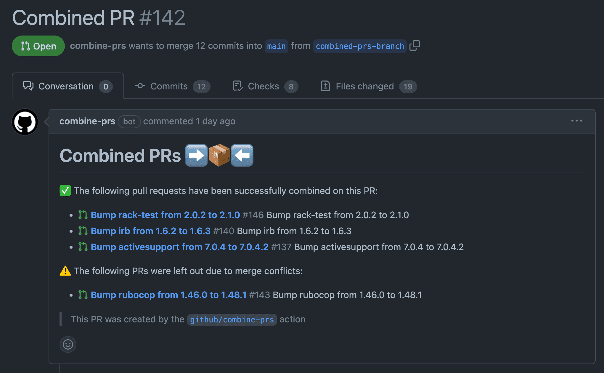

# combine-prs ➡️📦⬅️

[](./badges/coverage.svg)

GitHub Action to combine multiple PRs into a single one

## About 💡

GitHub uses this Action to combine multiple dependabot PRs into a single one. Rather than having to deploy each PR individually, we can run this Action on a `cron` or `workflow_dispatch` to combine all the PRs into a single one to make dependency management just a little bit easier.

This Action is customizable so you can use it for your own purposes and it doesn't have to be specific to dependabot PRs.

## Inputs 📝

| Name | Description | Default | Required |
| ---- | ----------- | ------- | -------- |
| `github_token` | GitHub token to use for authentication within this Action | `${{ github.token }}` | `true` |
| `branch_prefix` | Prefix for the branch name to use for the combined PR | `dependabot` | `true` |
| `ci_required` | Whether or not CI should be passing to combine the PR - can be `"true"` or `"false"`  | `"true"` | `true` |
| `ignore_label` | The label to ignore when combining PRs | `"nocombine"` | `true` |

## Outputs 📤

| Name | Description |
| ---- | ----------- |
| `pr_url` | The pull request URL if a PR was created |
| `pr_number` | The pull request number if a PR was created |

## Example 📸

Here is a PR example of this Action:



The Action ran on a cron, looked for all branches that had the `dependabot` prefix and then combined them into a single PR.

This allows us to deploy all the dependency updates at once rather than having to deploy each one individually.

## Usage 💻

Here is a brief example of how to use this Action in a workflow:

```yaml
name: Combine PRs

on:
  schedule:
    - cron: '0 1 * * 3' # Wednesday at 01:00
  workflow_dispatch: # allows you to manually trigger the workflow

jobs:
  combine-prs:
    runs-on: ubuntu-latest

    steps:
      - name: combine-prs
        id: combine-prs
        uses: github/combine-prs@vX.X.X # where X.X.X is the latest version
```

## CI and Action's Token 🤖

If you need CI to re-run on your newly created "combined" PR, you'll need to use a token that has write access to your repository. This is because the default `github.token` that is provided to Actions prevents CI from running on new commits to prevent recursive workflows. You can use a personal access token or a GitHub App token to get around this.

```yaml
- name: combine-prs
  id: combine-prs
  uses: github/combine-prs@vX.X.X # where X.X.X is the latest version
  with:
    github_token: ${{ secrets.PAT }} # where PAT is a GitHub Action's secret containing a personal access token
```

Alternatively, you can use a GitHub App token. This is the recommended approach as it is more secure than a personal access token and a lot more scalable for large organizations. The following open source [Action](https://github.com/marketplace/actions/use-app-token) helps to generate a GitHub App token for you which can then be passed into the `combine-prs` Action.

Here is an example doing exactly that:

```yaml
name: Combine PRs

on:
  schedule:
    - cron: '0 1 * * 3' # Wednesday at 01:00
  workflow_dispatch:

jobs:
  combine-prs:
    runs-on: ubuntu-latest

    steps:
      - name: Use GitHub App Token
        uses: wow-actions/use-app-token@d7957e08172ca2e8e49b35b8d266ad585885edc7 # pin@v2.0.2
        id: generate_token
        with:
          app_id: ${{ secrets.APP_ID }} # The ID of the GitHub App
          private_key: ${{ secrets.PRIVATE_KEY }} # The private key of the GitHub App
          fallback: ${{ secrets.GITHUB_TOKEN }} # fall back to the default token if the app token is not available

      - name: combine-prs
        uses: github/combine-prs@vX.X.X # where X.X.X is the latest version
        with:
          github_token: ${{ steps.generate_token.outputs.BOT_TOKEN }} # A GitHub app token generated by the previous step
```

If you go the GitHub App route, it will need the following permissions:

- Commit statuses: `Read-only`
- Contents: `Read and write`
- Metadata: `Read-only`
- Pull requests: `Read and write`
